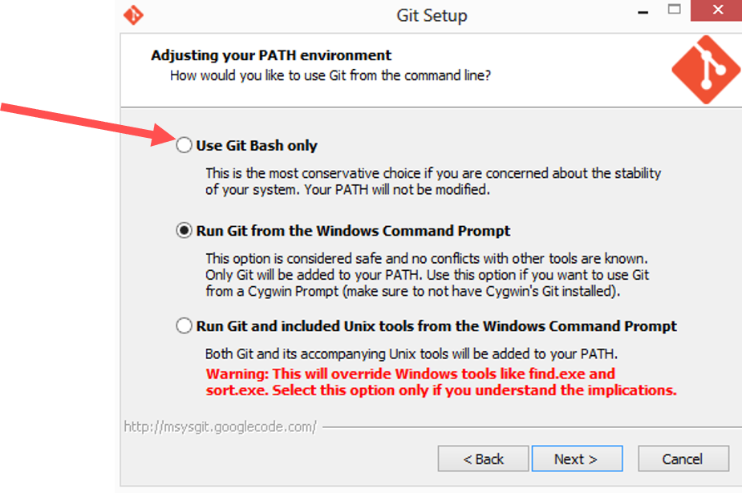
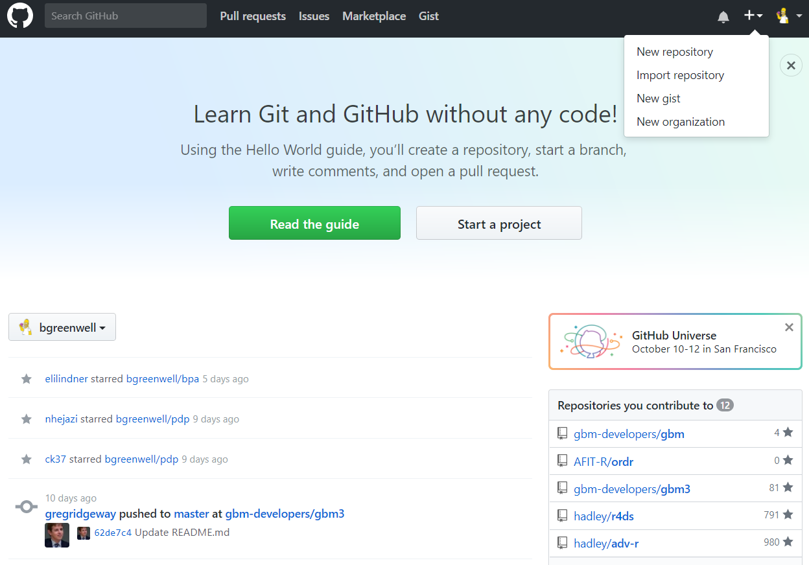

# Overview

```{r setup, echo=FALSE}
knitr::opts_chunk$set(echo = FALSE, fig.align = 'center')
shiny::includeCSS("css/flatly-style.css")
shiny::includeCSS("css/r-title.css")
shiny::includeScript("js/jquery.min.js")
shiny::includeScript("js/jkf-scroll.js")
```

## This presentation covers the following concepts

- Getting started with Git and Github

- Why you should use Git & Github

- The basics of version control systems

- Using Git and Github for collaborative software development

# Getting Started with Git & Github

## What is Git?

- A tool invented by Linus Torvalds (and the Linux development community) to develop the Linux kernel in 2005

- A <u>distributed</u> version control system that's free and open source

- An excellent way to track and coordinate file changes among many people

- A system for filing every draft of every document in a project

- The most widely used modern version control system in the world -- <focus>by far</focus>

- Free software distributed under the terms of the [GNU General Public License](https://en.wikipedia.org/wiki/GNU_General_Public_License) version 2

- While mainly used for code, Git can be used to manage any type of file/project 
  
    + Word documents
    
    + Final Cut projects
    
    + The entire volume of [German federal laws](https://github.com/bundestag/gesetze)

## What is GitHub?

- A hosting service for sharing and publishing documents

- A social networking site for programmers

- The single largest web-based service for hosting Git repositories

- A popular way to collaborate on code (no more emails and zip files!!)

    + The development versions of many R packages are hosted on GitHub: https://github.com/tidyverse/ggplot2
    
    + All the [cool kids](https://github.com/auburngrads) are using it!

- Includes several features beyond command-line Git

    + A Web-based graphical interface
    
    + Task/project management tools
    
    + A [martketplace](https://github.com/marketplace) of integrations for many 3^rd^ party services
    
    + [Issues!](https://guides.github.com/features/issues/)
    
    + [Forking!](https://guides.github.com/activities/forking/)
    
    + [Projects!](https://help.github.com/articles/about-project-boards/)
    
    + [Wikis!](https://help.github.com/articles/about-github-wikis/)
    
    + [Pages!](https://pages.github.com/)

# Why Should You use Git and GitHub?

## For a fast, easy, and stress-free workflow


<ul style="display:inherit;">
- Workflows without Git typically consist of

    * Lots of File renaming
    * Absurd folder structures
    * Zipped folders
    * E-mailing files back and forth
    * Lost files
    * Shared directories (one-at-a-time)
    * Ever try merging MS Word files with tracked changes?!
</ul>

<div id="container2">
<div id="container1">

<div id="col1">
<center>
Your workflow - <font color='red'><u>without</u></font> Git
<br/>
<p>

</p>
</center>
</div>

<div id="col2">
<center>
Your workflow - <font color='green'><u>with</u></font> Git
<br/>
<p>

</p>
</center>
</div>
</div>
</div>

# OK, I'm interested in using Git/Github how do I get Started?

## Installing Git <!--Kallhoff-->

- Installing Git is simple - on Mac/Windows/Linux/Unix

    1. Download Git from <https://git-scm.com/downloads>. 
    2. For Mac/Linux/Unix - Accept all installation defaults
    3. For Windows - accept all installation defaults __EXCEPT__ Choose Use Git Bash as the default editor

```{r, out.width = "800px", fig.align='center'}

```

## Setting up a GitHub account <!--Stuntz-->

- First, navigate to [https://github.com/](https://github.com/)

```{r, out.width = "800px", fig.align='center'}
knitr::include_graphics("images/github.png")
```

- Enter some basic information about your new account

    + A pithy username (hopefully it's still available)
    + An email address (don't use your @afit.edu email)
    + A password

```{r, out.width = "400px"}
knitr::include_graphics("images/signup.png")
```

- Set up your profile

```{r, out.width = "700px"}
knitr::include_graphics("images/my-profile.png")
```

## Configure Git for first time <!--Munson-->

- After installing Git and setting up a Github account

    + You need modify the `global` Git configuration file to tell Git who you are
    + Open a terminal or Git Bash (Windows) and enter the following two lines: (with the obvious modifications) 
    
```{sh, eval=!TRUE}
# Use Github username 
git config --global user.name Auburngrads

# Use Github email address
git config --global user.email auburngrads@live.com
```

- Since you passed the option `--global`, you only need to do this once!

## Now your all set up to use Git & Github!

- <focus>However</focus> - before we dive too deep into Git, we need to take a step back 

    + Git is one of many different version control systems (VCS)

    + It's important to put Git in context 
    
    + You should understand what a VCS is, what types of VCS exist, and how they differ

# Understanding Version Control Systems

## What are version control systems? <!--Butt-->

## Why should some use a version control system? <!--Elliot-->

## What is a Centralized Version Control System (CVCS)? <!--Gallagher-->

## What is a Decentralized (aka Distributed) Version Control System (DVCS)? <!--Johnson-->

## What are the advantages of using a DVCS instead of a CVCS? <!--Uhorchak-->

# Using Git - Overview

## Expectation management - this tutorial won't cover all use-cases

- New users often struggle learning how to use Git and conclude that it's too hard

- This struggle is driven by the fact that there seems to be an endless number of use cases

- The issue is NOT that Git is too <u>hard</u> to learn, rather Git is too <u>big</u> to learn

- The fact that Github adds it's own functions makes things even more complicated

- Remember <focus>Git $\ne$ Github</focus>

## Many Ways To Use Git <!--Trigo-->

- At the **command line**

    + Simplest (really!) & fastest
    + Works the same on Windows, Mac, and Linux
    
- Within an IDE (e.g. RStudio)

    + Convenient when building R packages
    + Can be clunky to update many files
    
- From a Git [desktop GUI](https://git-scm.com/downloads/guis)

    + Works well for many files
    + Adding another application can interrupt the workflow

- Hybrid method with [libgit2](https://libgit2.github.com/)

    + Write custom scripts using the `git2r` package
    + Best option - but comes with a semi-steep learning curve

## The basic process of Git

- Initialize Git version tracking in a directory
- Add or edit files in the directory
- Check the status of file changes in the directory
- Add changed files to the staging area
- Commit one or changed files to be updated
- Add a remote for hosting the files at a URL
- Push commits to the remote
- Send pull requests to collaborate with other users
- Check out the [Git Flow interactive](https://guides.github.com/introduction/flow/)

## The basic Git commands you'll use/need <!--Ramirez/Sevier-->


<!--
- `cd` (change directories)
- `git init` (initialize a folder as a Git repo)
- `git add <file-name>` (start tracking a new file)
- `git commit -m "fix typo"` (commit your changes)
- `git clone` (clone/copy another Git repo [e.g., from GitHub])
- `git push origin master` (push your master branch to your origin server)
- `git pull origin master` (update your local repo)
**Tip\:** Typing `git add --all` will start tracking everything (this is how I almost always use `git add`).
-->

# Using Git - Example commands

- Initialize a repo in an existing directory

    + Create a new folder called `arithmetic` anywhere on your computer (e.g., the Desktop) 
    + In this folder, create a new R script file called `add.R` 
    + In this new file add the following code
    
```{r, echo=TRUE}
add <- function(x, y) { x * y }
```

## Initializing a repo in an existing directory

- Next, open a terminal or Git Bash (Windows) and go to the project's root directory

- For example, the code below takes me to the folder called `arithmetic` on my Desktop

```{sh, echo=TRUE, eval=F}
cd C:/Users/Aubur/Desktop/arithmetic
```

- Then, to initialize this as a Git repo, just type

```{sh, echo=T, eval=F}
git init
```

- This add a new directory called `.git` within the `arithmetic` project directory

- If you want to start version-controlling all the files, you need to start tracking them. In the terminal, type the following:

```{sh, eval=F, echo=T}
git add --all
```

- This adds all of the files to the staging area 

- Then type the following to commit the file changes 

```{sh, eval=F, echo=T}
git commit -m "first commit"
```

## The .git directory <!--Small-->

# Using Git - Syncing with GitHub

## Overview

- Often, you'll want to host a local Git repo on Github to use the collaboration tools

- To do this, we'll first need to create a new repo on Github

```{r, out.width = "600px"}

```

- The name of the Github repo doesn't have to be the same as that of the local repo, but it probably should 

```{r, out.width = "600px"}
knitr::include_graphics("images/new-repo-2.png")
```

- Next, we'll add the URL of the Github repo as a `remote` to the local repo 

- The `remote` acts like an online target for pushed changes 

```{r, out.width = "700px"}
knitr::include_graphics("images/new-repo-3.png")
```

- Finally, we'll push the an image of the local repo's current state and the entire change history to the `remote` 

```{r, out.width = "700px"}
knitr::include_graphics("images/new-repo-4.png")
```

## Working with Github remotes <!--Smith-->

# Using Git - Making changes and pushing them to GitHub

## Fixing the typo

- The function in the `add.R` file contained an obvious typo

- First, let's fix the typo in `add.R`

- Now if we run status it should show that one file has been modified 
- Then, take a snapshot (i.e., `git add/commit`) and push the changes to GitHub (i.e., `git push`)!

```{sh, eval=F, echo=T}
git add --all
git commit -m "fix typo"
git push origin master
```

- Finally, refresh your browswer and see if it worked!

```{r, out.width = "700px"}
knitr::include_graphics("images/new-repo-5.png")
```

- **Tip\:** It's good practice to do this every time you make a key change (e.g., fix a typo, add a new function to an R script, etc.).

- Make sure you're in the right directory!

# All done!

## Any questions?

```{r, out.width = "400px"}

```

